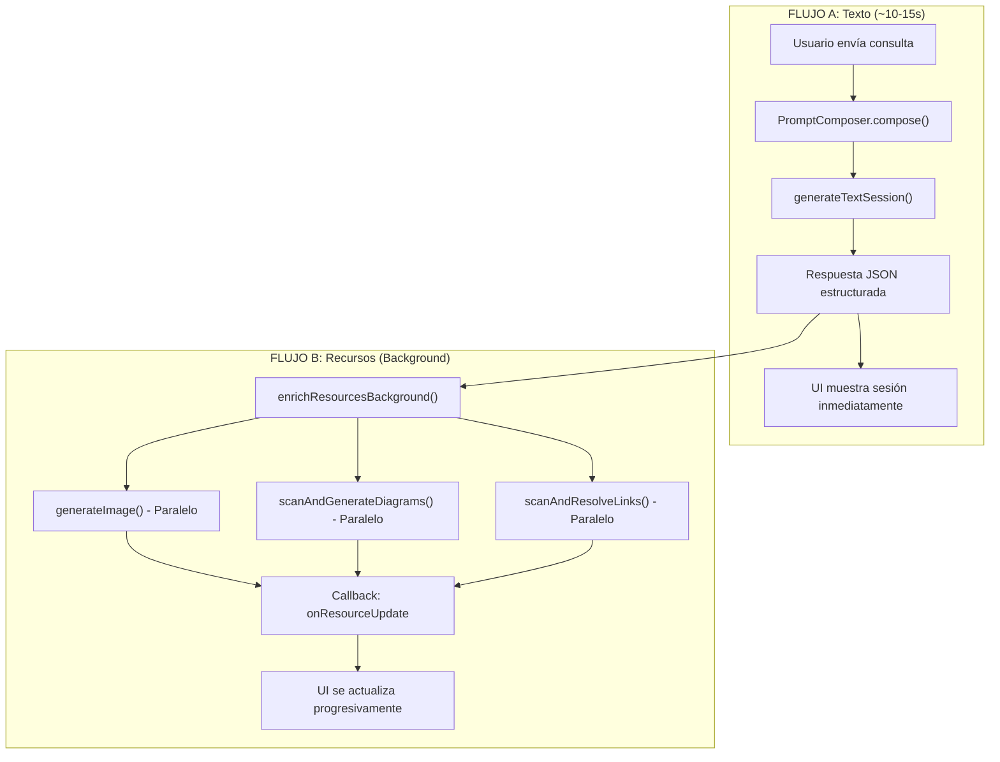
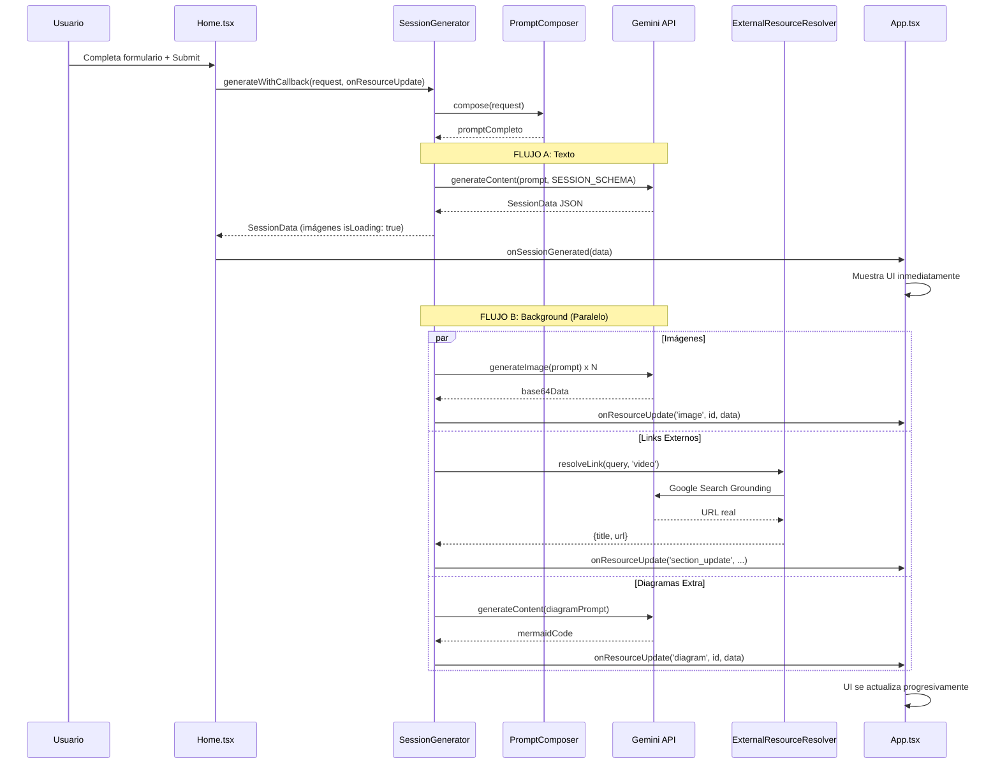

# 📊 Análisis Completo del Codebase: HG_sessionGen

> **Aula Express** - Generador Modular de Sesiones de Aprendizaje con IA

---

## 📁 Estructura del Proyecto

```
HG_sessionGen/
├── core/                     # Lógica central de generación
│   ├── SessionGenerator.ts   # Orquestador principal (Flujo A + B)
│   ├── PromptComposer.ts     # Compositor de prompts
│   ├── ExternalResourceResolver.ts  # Resolución de recursos externos
│   ├── RetryPolicy.ts        # Política de reintentos
│   └── ...
├── prompts/                  # Definiciones de prompts modulares
│   ├── index.ts              # Exportador central
│   ├── prompt_maestro.ts     # Prompt base (identidad, rol, restricciones)
│   ├── prompt_inicial.ts     # Estrategia para nivel Inicial
│   ├── prompt_primaria.ts    # Estrategia para nivel Primaria
│   ├── prompt_secundaria.ts  # Estrategia para nivel Secundaria
│   ├── prompt_recursos.ts    # Instrucciones de recursos virtuales
│   ├── prompt_imagenes.ts    # Flujo B: generación de imágenes
│   ├── prompt_diagramas.ts   # Flujo B: generación de diagramas
│   └── prompt_fichas.ts      # Instrucciones para fichas
├── schemas/
│   └── sessionSchema.ts      # Esquema JSON para Gemini
├── services/
│   └── geminiService.ts      # Cliente de API Gemini
├── components/               # Componentes React
│   ├── Home.tsx              # Vista principal (formulario)
│   ├── SessionResult.tsx     # Vista de resultados
│   ├── ResourcesPresenter.tsx # Presentador de recursos
│   └── DiagramRenderer.tsx   # Renderizador Mermaid
├── types.ts                  # Tipos TypeScript
└── App.tsx                   # Componente raíz
```

---

## 🔄 Arquitectura de Flujo Dual

El sistema implementa una **arquitectura de dos flujos** para optimizar el tiempo de respuesta:



### Flujo A: Generación de Texto (Bloqueante)

1. El usuario completa el formulario en `Home.tsx`
2. Se llama a `SessionGenerator.generateWithCallback()`
3. `PromptComposer.compose()` ensambla el prompt completo
4. Se envía a Gemini con `SESSION_SCHEMA` para respuesta estructurada
5. Se retorna `SessionData` inmediatamente con imágenes marcadas como `isLoading: true`

### Flujo B: Recursos (No-Bloqueante)

Ejecuta en paralelo después del Flujo A:

| Tarea | Método | Descripción |
|-------|--------|-------------|
| Imágenes | `generateImage()` | Genera imágenes con `gemini-2.5-flash-image` |
| Diagramas | `scanAndGenerateDiagramsWithCallback()` | Busca `DIAG_PROMPT:` en materiales |
| Links Externos | `scanAndResolveLinksWithCallback()` | Resuelve `VID_YT:` y `IMG_URL:` vía Google Search |

---

## 🎯 Sistema de Prompts

### Estructura Modular

```typescript
// prompts/index.ts
export const Prompts = {
    maestro,      // Identidad base
    inicial,      // Nivel Inicial
    primaria,     // Nivel Primaria  
    secundaria,   // Nivel Secundaria
    recursos,     // Instrucciones recursos virtuales
    fichas,       // Instrucciones fichas
    imagenes,     // Flujo B: imágenes
    diagramas,    // Flujo B: diagramas
};
```

### Composición del Prompt Final

El método `PromptComposer.compose()` ensambla el prompt en este orden:

```
╔══════════════════════════════════════════════╗
║  1. INSTRUCCIONES PRIORITARIAS DEL DOCENTE   ║  ← Máxima prioridad
╚══════════════════════════════════════════════╝
    - Nivel, Grado, Área
    - Pedido específico del docente
    - Reglas para recursos externos (VID_YT, IMG_URL)

--- 2. IDENTITY & CORE TASK (prompt_maestro) ---
    - Role: "Experto pedagogo peruano..."
    - Task: "Crear sesión en JSON alineada a MINEDU..."
    - Style: "Redacción clara, accionable..."
    - Constraints: ["teacherName: ___", "IDs estables", ...]

--- 3. ESTRATEGIA POR NIVEL ---
    - Focus: Según nivel (lúdico/concreto/analítico)
    - Materials: Tipo de materiales recomendados
    - Tone: Tono de comunicación
    - GradeRules: Reglas específicas por grado

--- 4. RECURSOS VIRTUALES (prompt_recursos) ---
    - Instrucciones para IMG_GEN, VID_YT, IMG_URL, DIAG_PROMPT

--- 5. FICHAS DE APLICACIÓN (prompt_fichas) ---
    - Instrucciones para fichas de aula y casa

--- 6. RECORDATORIO FINAL ---
    - Repetición del pedido del docente
```

### Selección por Nivel/Grado

```typescript
// En PromptComposer.compose()
let levelConfig: PromptBase = Prompts.primaria; // Default
if (nivel === 'Inicial') levelConfig = Prompts.inicial;
if (nivel === 'Secundaria') levelConfig = Prompts.secundaria;
```

Los **grados disponibles** se definen en `constants.ts` y se seleccionan en `Home.tsx`:

| Nivel | Grados |
|-------|--------|
| Inicial | 3 años, 4 años, 5 años |
| Primaria | 1° a 6° grado |
| Secundaria | 1° a 5° año |

---

## 🖼️ Generación de Imágenes

### Dónde se define el estilo

El estilo de las imágenes se define en múltiples lugares:

#### 1. En `prompt_imagenes.ts` (guidelines):

```typescript
guidelines: [
    "Respeta el nivel: más lúdico y simple en Inicial, 
     más concreto en Primaria, más analítico en Secundaria.",
    "El prompt debe ser específico y visualmente didáctico.",
    "Incluye la línea literal: 'Text inside the image must be in Spanish'.",
    "Evita marcas registradas y rostros de personas reales identificables."
]
```

#### 2. En `prompt_recursos.ts`:

```typescript
"IMÁGENES GENERADAS POR IA (resources.images):
- Genera entre 2 y 4 imágenes ilustradas si el tema lo amerita.
- El 'prompt' debe ser detallado y apto para un modelo de imagen IA.
- Incluye explícitamente: 'Text inside the image must be in Spanish'."
```

#### 3. En `SESSION_SCHEMA` (descripción del campo prompt):

```typescript
prompt: { 
    type: Type.STRING, 
    description: "Prompt descriptivo en inglés optimizado para generar 
                  la imagen (fotorealista o ilustración según nivel)." 
}
```

### Proceso de Generación

```typescript
// SessionGenerator.ts
private static async generateImage(prompt: string): Promise<string> {
    const response = await ai.models.generateContent({
        model: "gemini-2.5-flash-image",  // Modelo de imagen
        contents: { parts: [{ text: prompt }] },
    });
    // Extrae base64 del inlineData
    return `data:${mimeType};base64,${data}`;
}
```

---

## 📊 Generación de Diagramas

Los diagramas se generan de dos formas:

### 1. Organizador Principal (Flujo A)

Generado automáticamente con la sesión en `resources.organizer`:

```typescript
organizer: {
    id: string,
    title: string,
    type: "mapa-conceptual" | "espina-pescado" | ...,
    mermaidCode: string,  // Código Mermaid
    description: string,
    textFallback?: string
}
```

### 2. Diagramas Adicionales (Flujo B)

Se detectan mediante el prefijo `DIAG_PROMPT:` en los materiales:

```typescript
// SessionGenerator.ts
const match = item.match(/DIAG_PROMPT:\s*(.+?)\s*::\s*(.+)/);
// Ejemplo: "DIAG_PROMPT: Ciclo del Agua :: Diagrama circular del ciclo hidrológico"
```

Se usa `prompt_diagramas.ts` para la generación:

```typescript
const promptText = `${Prompts.diagramas.instruction}\n\n` +
    `CONTEXTO: Nivel: ${nivel}, Grado: ${grado}, Area: ${area}\n` +
    `DIAGRAM REQUEST: Title: "${title}", Instruction: "${instruction}"\n\n` +
    `${Prompts.diagramas.outputContract}\n${Prompts.diagramas.guidelines}`;
```

---

## 🔗 Resolución de Recursos Externos

### Prefijos Parseables

| Prefijo | Propósito | Ejemplo |
|---------|-----------|---------|
| `IMG_GEN:` | Referencia a imagen IA | `IMG_GEN: Mapa del Perú` |
| `VID_YT:` | Video de YouTube | `VID_YT: Canción Vocales :: SEARCH: cancion infantil vocales` |
| `IMG_URL:` | Foto real externa | `IMG_URL: Elefante :: SEARCH: elefante africano foto` |
| `DIAG_PROMPT:` | Diagrama adicional | `DIAG_PROMPT: Ciclo :: instrucción` |

### Proceso de Resolución

```typescript
// ExternalResourceResolver.ts
static async resolveLink(query: string, type: 'video' | 'image') {
    const response = await ai.models.generateContent({
        model: "gemini-2.5-flash",
        contents: [{ role: 'user', parts: [{ text: prompt }] }],
        config: {
            tools: [{ googleSearch: {} }]  // Google Search Grounding
        }
    });
    
    // Extrae URL de groundingMetadata o del texto
    const chunks = response.candidates?.[0]?.groundingMetadata?.groundingChunks;
    // ...
}
```

---

## ⚡ Gestión de Llamadas Paralelas

El sistema usa `Promise.all` y `Promise.allSettled` para paralelismo:

```typescript
// SessionGenerator.ts - enrichResourcesBackground()

// 1. Imágenes en paralelo
const imagePromises = resources.images.map(async (img) => {
    const base64 = await this.generateImage(img.prompt);
    onUpdate?.('image', img.id, { ...img, base64Data: base64 });
});

// 2. Diagramas en paralelo  
const diagramPromises = this.scanAndGenerateDiagramsWithCallback(...);

// 3. Links externos en paralelo
const linkPromises = this.scanAndResolveLinksWithCallback(...);

// Esperar todos (fire-and-forget desde la perspectiva del caller)
await Promise.all([
    Promise.allSettled(imagePromises),
    diagramPromises,
    linkPromises
]);
```

### Callback de Actualización

```typescript
// Definido en types.ts
export type ResourceUpdateCallback = (
    type: 'image' | 'diagram' | 'section_update',
    resourceId: string,
    data: GeneratedImage | Organizer | { section, field, value }
) => void;
```

El callback se propaga desde `App.tsx` → `Home.tsx` → `SessionGenerator`:

```typescript
// App.tsx
const handleResourceUpdate: ResourceUpdateCallback = useCallback((type, id, resource) => {
    setCurrentSession(prev => {
        // Actualiza imagen, diagrama o sección según el tipo
        // ...
    });
}, []);
```

---

## 📝 Ejemplo Completo: Flujo de Consulta

### Consulta del Usuario

> *"Crea una sesión para el sonido inicial de las vocales, pero necesito que me busques un video de YouTube de una canción pegadiza sobre las 5 vocales, una que ya exista. Además, hazme 5 tarjetas grandes (con imágenes reales, sin dibujos) de objetos que empiecen con cada vocal para la motivación."*

### Paso 1: Recopilación de Datos (Home.tsx)

```typescript
const request: SessionRequest = {
    nivel: "Inicial",           // Seleccionado por el usuario
    grado: "5 años",            // Seleccionado por el usuario
    area: "Comunicación",       // Seleccionado por el usuario
    prompt: "Crea una sesión para el sonido inicial de las vocales..."
};
```

### Paso 2: Composición del Prompt (PromptComposer.compose)

El prompt final generado tiene esta estructura:

```
╔══════════════════════════════════════════════════════════════╗
║  INSTRUCCIONES PRIORITARIAS DEL DOCENTE - CUMPLIR AL PIE    ║
╚══════════════════════════════════════════════════════════════╝

CONTEXTO DE LA SESIÓN:
- Nivel: Inicial
- Grado: 5 años
- Área: Comunicación

PEDIDO ESPECÍFICO DEL DOCENTE (MÁXIMA PRIORIDAD):
"Crea una sesión para el sonido inicial de las vocales, pero 
necesito que me busques un video de YouTube de una canción 
pegadiza sobre las 5 vocales, una que ya exista. Además, hazme 
5 tarjetas grandes (con imágenes reales, sin dibujos) de objetos 
que empiecen con cada vocal para la motivación."

REGLAS DE INTERPRETACIÓN DE RECURSOS EXTERNOS:
1. Para videos: "VID_YT: Título Sugerido :: SEARCH: consulta"
2. Para fotos: "IMG_URL: Título Sugerido :: SEARCH: consulta"

═══════════════════════════════════════════════════════════════

Eres un experto pedagogo peruano y diseñador instruccional...
Crear una Sesión de Aprendizaje completa en JSON...

--- ESTRATEGIA PARA NIVEL INICIAL ---
Enfoque: Aprendizaje por juego, exploración sensorial, movimiento...
Materiales: Materiales grandes, coloridos, manipulables y seguros...
Tono: Muy lúdico, cariñoso, paciente, con lenguaje sencillo...
Reglas de Grado: ["En 'propositoDidactico' incluye solo un propósito"...]

--- RECURSOS VIRTUALES (IMPORTANTE) ---
1) IMÁGENES GENERADAS POR IA (resources.images):
   - Genera entre 2 y 4 imágenes ilustradas...
   
4) MATERIALES POR SECCIÓN:
   👉 IMG_GEN: <Título Exacto>
   👉 VID_YT: <Título> :: SEARCH: <consulta>
   👉 IMG_URL: <Título> :: SEARCH: <consulta>
   👉 DIAG_PROMPT: <Título> :: <instrucción>

--- FICHAS DE APLICACIÓN ---
Genera dos fichas de aplicación distintas...

--- RECORDATORIO FINAL ---
NO OLVIDES cumplir el pedido del docente: "Crea una sesión..."
```

### Paso 3: Llamada a Gemini (generateTextSession)

```typescript
const response = await ai.models.generateContent({
    model: "gemini-2.5-flash",
    contents: [{ role: 'user', parts: [{ text: fullPrompt }] }],
    config: {
        responseMimeType: "application/json",
        responseSchema: SESSION_SCHEMA,  // Fuerza estructura
    },
});
```

### Paso 4: Respuesta JSON Esperada del LLM

```json
{
  "sessionTitle": "Descubriendo el Sonido de las Vocales",
  "area": "Comunicación",
  "cycleGrade": "5 años",
  "teacherName": "___________",
  
  "inicio": {
    "motivacion": [
      "La docente saluda cantando 'Las vocales' mientras muestra las tarjetas.",
      "Presenta {{imagen:Tarjeta Vocal A}} y pregunta: ¿Qué ven aquí?"
    ],
    "saberesPrevios": ["¿Conocen las vocales? ¿Cuáles son?"],
    "conflictoCognitivo": ["¿Por qué creen que la A suena como en 'avión'?"],
    "propositoDidactico": ["Identificar el sonido inicial de las 5 vocales..."],
    "materiales": [
      "VID_YT: Canción de las Vocales :: SEARCH: cancion infantil vocales pegadiza español",
      "IMG_URL: Tarjeta Vocal A - Avión :: SEARCH: avion foto real fondo blanco",
      "IMG_URL: Tarjeta Vocal E - Elefante :: SEARCH: elefante foto real fondo blanco",
      "IMG_URL: Tarjeta Vocal I - Iglesia :: SEARCH: iglesia foto real fondo blanco",
      "IMG_URL: Tarjeta Vocal O - Oso :: SEARCH: oso foto real fondo blanco",
      "IMG_URL: Tarjeta Vocal U - Uvas :: SEARCH: uvas foto real fondo blanco"
    ]
  },
  
  "desarrollo": {
    "estrategias": [
      "La docente proyecta el video de la canción de las vocales.",
      "Los niños repiten cada vocal haciendo el gesto correspondiente.",
      "Se presenta {{imagen:Mapa Mental Vocales}} para reforzar."
    ],
    "materiales": [
      "IMG_GEN: Mapa Mental Vocales",
      "Pizarra, plumones"
    ]
  },
  
  "cierre": {
    "estrategias": ["Los niños identifican objetos del aula que empiecen con vocal..."],
    "materiales": ["Objetos del aula"]
  },
  
  "tareaCasa": {
    "actividades": ["Recortar y pegar 2 imágenes de objetos que empiecen con A, E, I, O, U"],
    "materiales": ["Revistas, tijeras, goma"]
  },
  
  "fichas": {
    "aula": {
      "titulo": "Mis Vocales",
      "instrucciones": ["Une cada vocal con el dibujo que empieza con ella"],
      "items": ["A - ___ (avión)", "E - ___ (elefante)", ...]
    },
    "casa": {
      "titulo": "Busco Vocales en Casa",
      "instrucciones": ["Con ayuda de papá o mamá, encuentra objetos..."],
      "items": ["A: ____", "E: ____", ...]
    }
  },
  
  "resources": {
    "organizer": {
      "id": "org-vocales",
      "title": "Las 5 Vocales",
      "type": "mapa-mental",
      "mermaidCode": "mindmap\n  root((Vocales))\n    A\n      \"Avión\"\n      \"Abeja\"\n    E\n      \"Elefante\"\n      \"Estrella\"\n    I\n      \"Iglesia\"\n      \"Iguana\"\n    O\n      \"Oso\"\n      \"Olla\"\n    U\n      \"Uvas\"\n      \"Unicornio\"",
      "description": "Mapa mental con las 5 vocales y ejemplos de palabras",
      "textFallback": "Vocales: A (avión, abeja), E (elefante), I (iglesia), O (oso), U (uvas)"
    },
    "images": [
      {
        "id": "img-inicio-tarjeta-a",
        "title": "Tarjeta Vocal A",
        "prompt": "Educational flashcard for preschool children, letter A with a colorful airplane illustration, playful cartoon style, bright colors, white background, simple and clear design. Text inside the image must be in Spanish.",
        "moment": "Inicio"
      },
      {
        "id": "img-desarrollo-mapa",
        "title": "Mapa Mental Vocales",
        "prompt": "Educational mind map poster for kindergarten showing the 5 Spanish vowels (A, E, I, O, U) connected to cute animal illustrations (avión, elefante, iglesia, oso, uvas), colorful, child-friendly design. Text inside the image must be in Spanish.",
        "moment": "Desarrollo"
      }
    ],
    "diagrams": []
  }
}
```

### Paso 5: Flujo B - Enriquecimiento en Background

Una vez retornada la sesión, se ejecutan en paralelo:

```typescript
// 1. IMÁGENES (Paralelo)
// Genera: "Tarjeta Vocal A", "Mapa Mental Vocales"
resources.images.forEach(img => {
    generateImage(img.prompt).then(base64 => {
        onUpdate('image', img.id, { ...img, base64Data: base64 });
    });
});

// 2. LINKS EXTERNOS (Paralelo)
// Detecta en materiales:
// - "VID_YT: Canción de las Vocales :: SEARCH: cancion infantil vocales..."
// - "IMG_URL: Tarjeta Vocal A - Avión :: SEARCH: avion foto real..."

sections.forEach(section => {
    section.items.forEach(item => {
        const match = item.match(/^(VID_YT|IMG_URL):\s*(.+?)\s*::\s*SEARCH:\s*(.+)$/i);
        if (match) {
            ExternalResourceResolver.resolveLink(query, type).then(result => {
                // Reemplaza: "VID_YT: Canción :: SEARCH: ..." 
                //        → "VID_YT: Canción de las Vocales :: https://youtube.com/..."
                onUpdate('section_update', sectionKey, { section, field, value });
            });
        }
    });
});

// 3. DIAGRAMAS ADICIONALES (Paralelo)
// Busca "DIAG_PROMPT:" en materiales y genera código Mermaid adicional
```

### Paso 6: Actualización de UI (App.tsx)

```typescript
const handleResourceUpdate: ResourceUpdateCallback = (type, id, resource) => {
    setCurrentSession(prev => {
        if (type === 'image') {
            // Actualiza imagen específica con base64Data
            return { ...prev, resources: { ...prev.resources, images: updated } };
        }
        if (type === 'section_update') {
            // Actualiza materiales con URLs reales resueltas
            return { ...prev, [section]: { ...prev[section], [field]: value } };
        }
        // ...
    });
};
```

---

## 🎨 Diagrama de Secuencia Completo



---

## ✅ Resumen de Puntos Clave

| Aspecto | Implementación |
|---------|----------------|
| **Flujo de consulta** | Dual: Texto (bloqueante) + Recursos (background) |
| **Composición de prompts** | Modular en `prompts/*.ts`, ensamblado en `PromptComposer` |
| **Selección por grado** | `constants.ts` + lógica en `Home.tsx` y `PromptComposer` |
| **Estilo de imágenes** | Definido en `prompt_imagenes.ts`, `prompt_recursos.ts`, y `SESSION_SCHEMA` |
| **Generación de imágenes** | `gemini-2.5-flash-image` en `SessionGenerator.generateImage()` |
| **Diagramas** | Organizador principal (Flujo A) + extras vía `DIAG_PROMPT:` (Flujo B) |
| **Recursos externos** | `ExternalResourceResolver` con Google Search Grounding |
| **Paralelismo** | `Promise.all` + `Promise.allSettled` en `enrichResourcesBackground()` |
| **Actualización UI** | Callback `ResourceUpdateCallback` propaga cambios a `App.tsx` |

---

*Análisis generado el 8 de diciembre de 2025*
